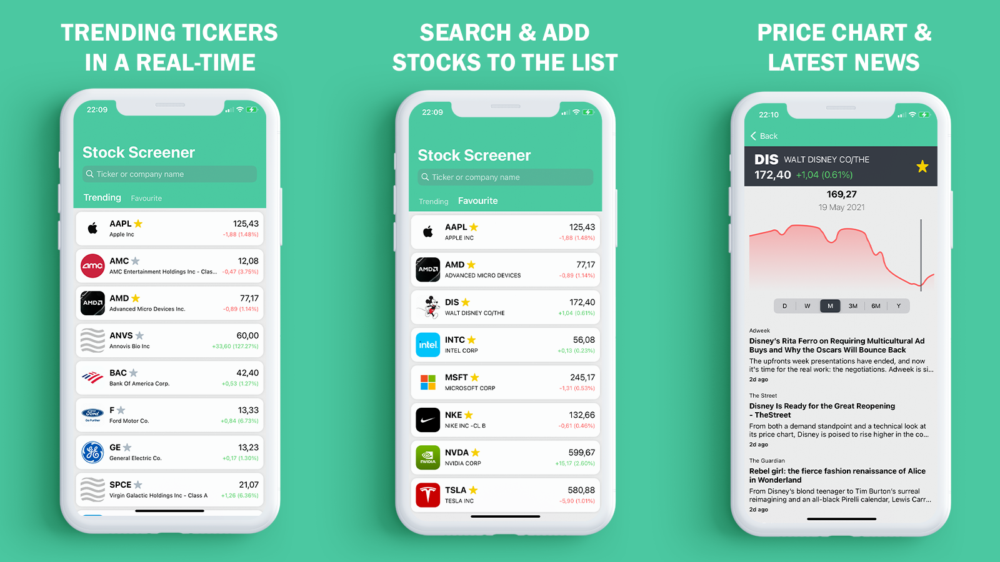

## Features: 
• Track stock trends and price changes: latest data asynchronously parsed from several third-party API’s using URLSession with Generics and Result type and multithreading via GCD
• Add favorite tickers to the list: self-implemented methods to save dictionary via Realm
• See detailed info: custom chart with period picker (day, month, year) that shows price and date at the tap position using Charts; latest news parsed from API can be displayed in SFSafariViewController
• Search for specific ticker: results parsed from API and displayed by UISearchController

## Quick Start:
1. Clone or download the project.
2. Dependencies are already in the repository.
3. Open <b>Stock Screener.xcworkspace</b> with Xcode.
